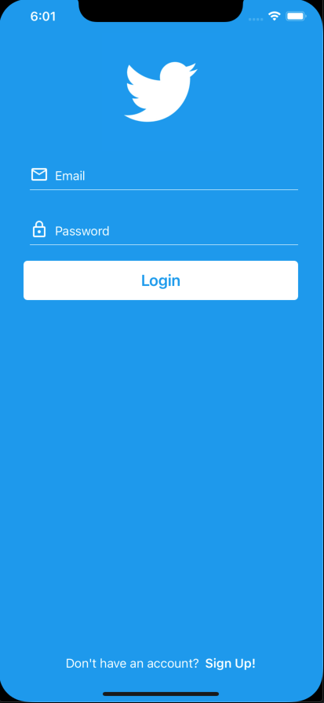

# Twitter clone Example with Swift
## Gif of the app

## Functionalities
- Firebase Login/Register
- Feed

  - Create tweets (with mentions)

  - Like tweets

  - Reply to tweets

  - See tweets only from users you are following

- Explore

  - Search for users

- Profile

  - See details about user's profile 

  - Update your profile

  - See user's tweets/replies/likes

- Notification

  - page to see notifications about Likes/Mentions/Follows

## Screenshots
   

    

.  

    

    

